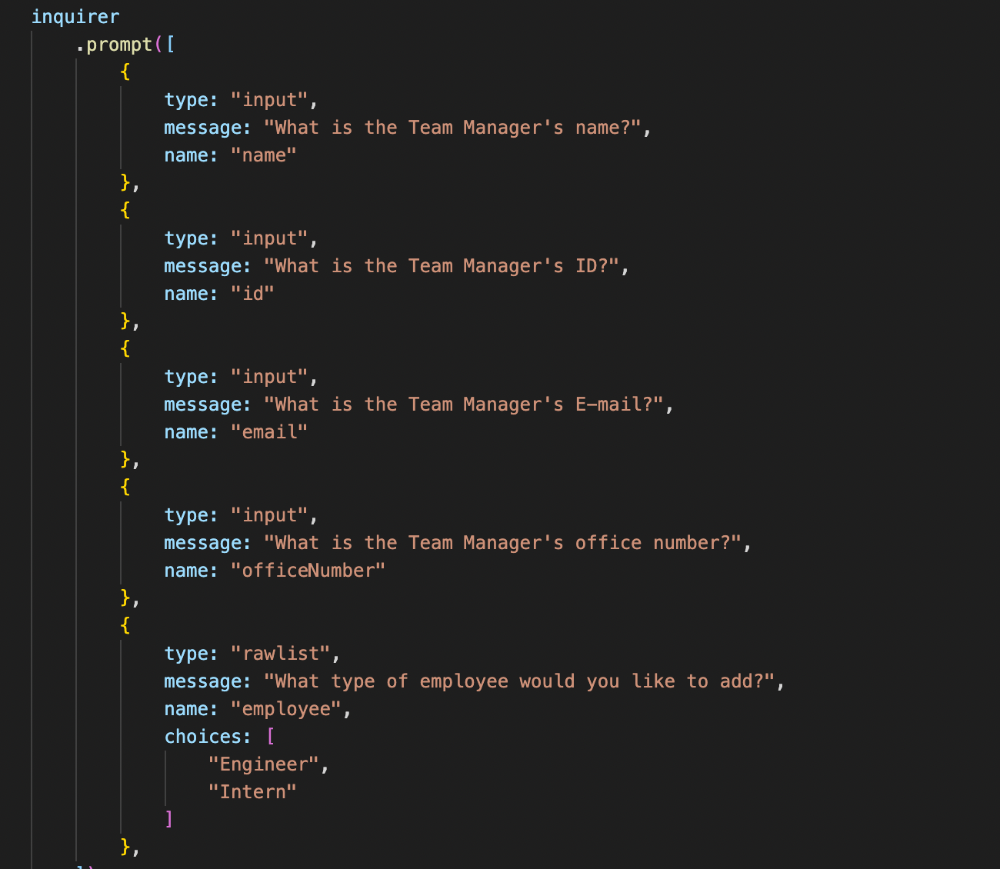
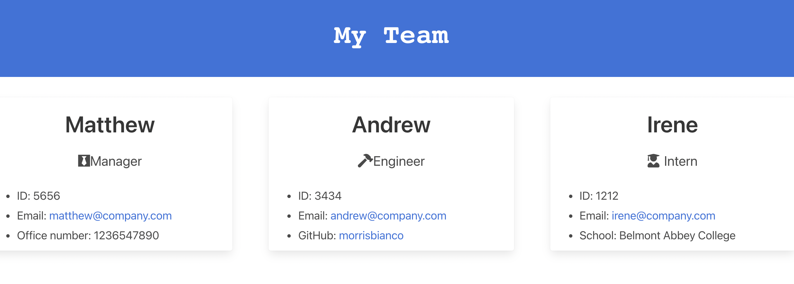

# Team Profile Generator Project

## Table of Contents
            
- [Description](#Description)
- [Usage](#Usage)
- [Questions](#Questions)

### Description
For this project, I was tasked to create an application that will generate a team profile through a series of prompts from the inquirer npm. To do this project, I started by coming up with a series of tests for my classes. When all of these tests passed, I had my classes set up and ready for the prompts. To make the prompts, I used inquirer and split up the questions so that you could make whichever employee you wanted and as many as you would like. The questions start with the manager and leave you the freedom to choose between the engineer and intern. After you choose which one to start with, you are returned to a prompt that asks you if you would like to continue adding employees. Once you are content with your employees, you can select that you are done and it will render the html page with all of your employees added.

After the questions, you can open the html in the browser and see the information you put in displayed through a series of cards. If you click on the github link, it will open that github account in a new tab. If you click on the email, it will start an email draft to that email account. 

### Usage
To use this application, you need to open the project in the terminal and run node app to start the prompts. After you answer each prompt, your choices will be added to the team.html in the output folder. If you open this html in the browser, you will see cards of all of your team members and their information. 

This video will show a step-by-step guide to how this is done. <a href="https://www.awesomescreenshot.com/video/4100862?key=af12a5b954e078b14d925e0a7babf2aa">Video Guide</a>

### Questions
My Github: https://github.com/morrisbianco

andrewbianco98@gmail.com: Please contact me through this E-mail address with any further questions that you may have.
            